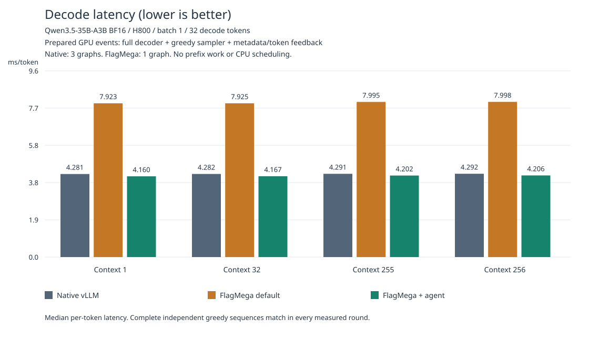
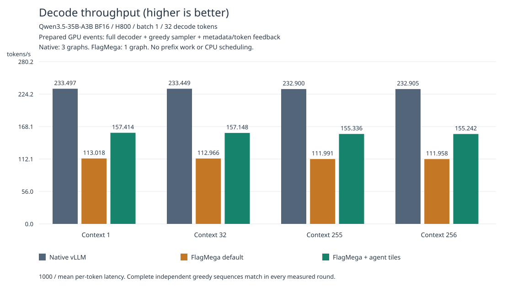

# Qwen3.5-35B-A3B BF16 / H800

## Reproduction

The target is **batch-size-1, single-token decode** with the complete 40-layer BF16 decoder,
including hybrid Gated DeltaNet/attention, routed and shared experts, embedding,
final normalization and LM head. Vision inputs are outside this text-decode
workload, as in tutorial 01. Prefill implementation, optimization and performance
are outside the scope. Small op/layer tests are development checks, not
substitutes for the complete-model acceptance.

Run from the repository root with the TLE-enabled FlagTree environment:

```sh
export TUTORIAL="$PWD/python/tutorials/flagmega/02-qwen3.5-35b-a3b-bf16-h800"
export PYTHONPATH="$PWD/python:$TUTORIAL${PYTHONPATH:+:$PYTHONPATH}"
python "$TUTORIAL/prepare_checkpoint.py" --output "$TUTORIAL/.local/checkpoint"
export CHECKPOINT="$TUTORIAL/.local/checkpoint"
python -m triton.flagmega import --model "$CHECKPOINT" --full-model \
  --revision 59d61f3ce65a6d9863b86d2e96597125219dc754 \
  --mode decode-1 --num-tokens 1 \
  --numerical-profile vllm-ae10e855a-inductor-level3 \
  --output "$TUTORIAL/.local/imported.py"
python -m triton.flagmega verify "$TUTORIAL/.local/imported.py"
```

The checkpoint is pinned to revision
`59d61f3ce65a6d9863b86d2e96597125219dc754` of
[Qwen/Qwen3.5-35B-A3B](https://huggingface.co/Qwen/Qwen3.5-35B-A3B/tree/59d61f3ce65a6d9863b86d2e96597125219dc754).
The download contains approximately 71.9 GB of safetensors, before compiler
artifacts. `--metadata-only` fetches configuration, tokenizer and tensor index
without weights. Downloads can be resumed by rerunning the same command.

Import emits editable `imported.py` and readable `imported.il`. The complete
text graph has `main` plus reusable `decode_linear` and `decode_attention`
functions, called 30 and 10 times respectively. Import reads weight metadata,
not model-sized tensor values. The selected profile declares the pinned vLLM
decode semantics. Import and device compilation do not by themselves prove
complete-model numerical acceptance; run the independent checks below.

For IR iteration, save a complete checkpoint before memory allocation:

```sh
python "$TUTORIAL/optimize.py" --checkpoint "$CHECKPOINT" \
  --input "$TUTORIAL/.local/imported.py" \
  --trial "$TUTORIAL/.local/pre-bufferize" \
  --stop-after plan-function-memory --compile-only
python "$TUTORIAL/optimize.py" --checkpoint "$CHECKPOINT" \
  --input "$TUTORIAL/.local/pre-bufferize/final.py" \
  --trial "$TUTORIAL/.local/fast" --bufferize-opt-level fast --compile-only
python "$TUTORIAL/optimize.py" --checkpoint "$CHECKPOINT" \
  --input "$TUTORIAL/.local/pre-bufferize/final.py" \
  --trial "$TUTORIAL/.local/optimized" --bufferize-opt-level optimized \
  --rdata-cache-dir "$TUTORIAL/.local/rdata-cache"
python -m triton.flagmega artifact verify "$TUTORIAL/.local/optimized/artifact"
```

`fast` uses first-fit allocation; `optimized` uses SAT and is the default.
Both retain alias, lifetime, alignment, capacity and synchronization checks.
Switch levels from the pre-bufferize checkpoint, not an already allocated IR.
`--compile-only` avoids materializing weights. Omitting it emits an executable
artifact; the final command above verifies its manifest and data. Each trial
directory must be new. Changing expert tile
parameters requires resuming before TIR candidate proposals, or from import;
do not reuse the pre-bufferize checkpoint for a different tile configuration.

### Independent Decode Acceptance

Use a separate Python 3.10 environment for the pinned native reference. Do not
install its stock Triton into the FlagTree environment. The requirements pin
the official vLLM wheel, including its SHA256, and the numerical dependencies
used by this tutorial. Choose an idle H800 and use it for sequential comparisons.

```sh
python3.10 -m venv "$TUTORIAL/.local/vllm-env"
env -u PYTHONPATH "$TUTORIAL/.local/vllm-env/bin/python" -m pip install \
  -r "$TUTORIAL/requirements-reference.txt"
export OMP_NUM_THREADS=1 MKL_NUM_THREADS=1
env -u PYTHONPATH "$TUTORIAL/.local/vllm-env/bin/python" \
  "$TUTORIAL/prepare_reference.py" --checkpoint "$CHECKPOINT" \
  --trial "$TUTORIAL/.local/reference" --contexts 1 32 255 256 --steps 32
```

The reference prepares prefix state outside the decode workload, then generates
32 tokens independently for each existing-context length. The boundary input
token is not counted as a candidate output. Candidate execution restores its
own private state once and subsequently feeds back only its own generated
tokens, never reference outputs. Exact complete greedy sequences are required.

In the FlagTree environment, select the tested PTXAS **13.3.73** and validate
the baseline artifact (then repeat with the agent artifact below):

```sh
export TRITON_PTXAS_PATH="$TUTORIAL/.local/vllm-env/lib/python3.10/site-packages/nvidia/cu13/bin/ptxas"
"$TRITON_PTXAS_PATH" --version
python "$TUTORIAL/accuracy.py" --checkpoint "$CHECKPOINT" \
  --artifact "$TUTORIAL/.local/optimized/artifact" \
  --reference "$TUTORIAL/.local/reference/report.json" \
  --trial "$TUTORIAL/.local/baseline-check" --label current_compiler_baseline \
  --benchmark-repeats 5
```

Optional GPU timing includes the complete decoder, logits, greedy sampling,
state advancement and device token feedback. Prefix work, state restoration,
token tracing, host reads, loading, compilation and warmup are excluded.
These graph measurements alone are not serving latency or a native-vLLM comparison;
the native run below supplies the corresponding comparison.

Measure native vLLM at the prepared-decode boundary in its isolated environment,
after the FlagMega process has exited:

```sh
env -u PYTHONPATH "$TUTORIAL/.local/vllm-env/bin/python" \
  "$TUTORIAL/benchmark_vllm.py" --checkpoint "$CHECKPOINT" \
  --reference "$TUTORIAL/.local/reference/report.json" \
  --trial "$TUTORIAL/.local/native-check" --repeats 5
```

This preserves vLLM's original FULL model graph and native greedy sampler.
Timing spans prepared metadata updates, the model, LM head, sampling and GPU
token feedback. The native path uses three graph launches inside one GPU event
interval; FlagMega uses one graph. Both include dispatch gaps within the interval,
exclude CPU scheduling and prefix preparation, and verify complete independent
sequences from private initial state on every round. Native metadata schedules
contain positions, lengths, slots and attention scheduling data, not token inputs
or intermediate KV/GDN state. This is a GPU execution comparison, not a vLLM
serving integration or end-to-end request benchmark.

## Workload-Specific Agent Optimizations

The accepted policy and implementations live in `agent_optimizations/`. They
extend the normal IR, pass, candidate-provider and Jinja-template interfaces;
generated kernel source is never patched after compilation.

- **Projection ownership:** select N-sharded, full-K output projections and
  compatible downstream layouts. This retains the TMA projection/residual/stats
  fusion instead of a split-K SIMT path with many output loops and a subsequent
  cross-owner reduction. The normal distribution solver still checks the whole
  plan for compatibility.
- **Expert kernels:** use gate/up `(N, K) = (4, 2048)` and down `(16, 512)`,
  compared with the default `(8, 128)`. Local kernel overrides pipeline dynamic
  expert-route prefetch with three stages. Expert IDs remain runtime inputs.
- **GDN:** use value/projection tiles of `32/2048` and a paired compensated A/B
  projection that shares input loads, while retaining the recurrent state ABI.
- **Local fusions and selections:** register staged routing, broadcast scalar
  scaling, gated residual/norm statistics and sigmoid-product IR with matching
  kernels. Choose elementwise tiles from local scalar capacity, up to 2048, and
  the `decode_t32` paged-attention implementation. These remove intermediate
  passes over data and reduce loop overhead for this workload.

These are workload-local decisions, not new compiler-wide defaults. Both
baseline and agent builds retain the same core compiler optimizations.

Rebuild this candidate from the original checkpoint with:

```sh
python "$TUTORIAL/optimize_agent.py" --checkpoint "$CHECKPOINT" \
  --trial "$TUTORIAL/.local/agent" \
  --bufferize-opt-level optimized --rdata-cache-dir "$TUTORIAL/.local/rdata-cache"
python -m triton.flagmega artifact verify "$TUTORIAL/.local/agent/artifact"
python "$TUTORIAL/accuracy.py" --checkpoint "$CHECKPOINT" \
  --artifact "$TUTORIAL/.local/agent/artifact" \
  --reference "$TUTORIAL/.local/reference/report.json" \
  --trial "$TUTORIAL/.local/agent-check" --label agent_optimized \
  --benchmark-repeats 5
```

For compile-only iteration, add `--compile-only --bufferize-opt-level fast`.
`--input` accepts imported Python IR or a complete `distribution_candidates`
checkpoint. Each build emits readable Before/After dumps, editable Python IR,
`distribution.plan.py`, final IR and a source-fingerprinted build report.

The built-in `distribution_plan.py` contains the accepted choices, grouped by
candidate family. It checks the logical graph fingerprint and the freshly
proposed candidate catalog, then constructs a new plan bound to that proposal's
exact hash. It does not overwrite hashes on stale plans or bypass compiler
validation. Fresh solver defaults can vary without changing the accepted
choices. If the logical graph changes, re-optimize instead of editing the
fingerprint to force acceptance. To supply your own plan, use
`--input <proposal.py> --distribution-plan <edited.plan.py>`; both must describe
the same proposal. `agent_optimizations/distribution.py` demonstrates selecting
output-owned projections and re-solving the coupled choices on a typed graph.

The published package has passed complete-model independent greedy checks for
all four decode scenarios, including loading its rebuilt artifact with only the
public tutorial package on `PYTHONPATH` and repeated measurements of that artifact.

`generated_kernels.py` is the accepted source snapshot, regenerated through the
normal compiler renderer. Its SHA256 is
`8d0a73fb9ca91d3b5f03205f4fa2c23d2873aa482c6b1424caff60acca459b9c`.
It is not a standalone model artifact: execution also requires final IR, the
manifest and approximately 64.6 GiB of readonly data produced by `optimize_agent.py`.
The hash identifies the measured snapshot; fresh builds can carry different
proposal-provenance metadata in their source headers.
The two decoder function bodies and their tensor-map tables are reused across
layers. No workload-specific changes to native Triton/TLE are required.

For repeated measurements, keep the artifacts fixed, use fresh check directories,
and reverse the variant order on the same idle GPU. For example, run agent,
baseline, native, then native, baseline, agent. Each check includes two warmup
rounds and five measured rounds with independent token feedback. Do not load
the native and FlagMega models simultaneously on the measured GPU.

Generate the comparison from those raw trial directories:

```sh
python "$TUTORIAL/render_results.py" \
  --reference "$TUTORIAL/.local/reference/report.json" \
  --native "$TUTORIAL/.local/native-check" "$TUTORIAL/.local/native-check-2" \
  --baseline "$TUTORIAL/.local/baseline-check" "$TUTORIAL/.local/baseline-check-2" \
  --agent "$TUTORIAL/.local/agent-check" "$TUTORIAL/.local/agent-check-2" \
  --output "$TUTORIAL/.local/comparison"
```

The script verifies every measured sequence and initial-state identity, rejects
mixed kernels or GPUs within a comparison, and recomputes statistics from the
raw GPU events. It writes `summary.json`, `decode_latency.svg`, and
`decode_throughput.svg`; the JSON is a measurement report, not serialized IR.

## Final Performance

Measured on one H800 with the complete 40-layer model, batch size 1 and 32
independently generated tokens per context. Variants ran sequentially, with two
runs of each fixed artifact/environment. Each process used two warmup rounds
and five measured rounds: **320 GPU event samples per variant per scenario**.
Every independent sequence, including warmup and timed rounds, exactly matched
the pinned native greedy sequence.

| Existing context | Native vLLM ms/token | FlagMega default ms/token | Agent ms/token | Agent tokens/s |
| --- | ---: | ---: | ---: | ---: |
| 1 | 4.281 | 7.923 | 4.160 | 240.37 |
| 32 | 4.282 | 7.925 | 4.167 | 240.00 |
| 255 | 4.291 | 7.995 | 4.202 | 238.00 |
| 256 | 4.292 | 7.998 | 4.206 | 237.73 |

Latency is the pooled per-token median; throughput is `1000 / mean_ms`, not the
inverse median. Agent p95 latency is 4.170–4.217 ms. The agent lowers latency by
47.4–47.5% versus the same current-core FlagMega default, with approximately
1.90× decode throughput. Agent median latency is 2.0–2.8% below the native vLLM
runs in this comparison. This small native margin is not a universal speedup:
earlier valid native measurements reached approximately 4.01 ms/token, so run
conditions can reverse that ranking. Re-measure all variants on your hardware.

Both FlagMega variants use SAT memory planning and include the same compiler
optimizations. The agent changes the workload-local distribution choices,
fusions, kernel implementations and tiles described above. Its compiled kernel
uses 148 registers/thread, 223868 bytes of shared
memory and 12 physical warps, with no spills; the cooperative grid is an 8×16
mesh of blocks on one GPU, not a multi-GPU mesh.





Timing includes metadata preparation, the full decoder, logits, native/compiled
greedy sampling and device token feedback. Prefix preparation, initial-state
restoration, token trace copies, CPU reads/scheduling, loading, compilation and
warmup are excluded. Cache policy is natural sequential decode, without a
synthetic flush. Native retains its original FULL graph, configured level-3
Inductor/custom-ops-none numerical profile and native sampler. Its normal
TritonExperts backend uses the pinned version's default H800 MoE tactics.
No prefill-inclusive, serving integration or end-to-end request speedup is claimed.

Raw results, working notes, tutorial tests and intermediate IR/artifacts stay
in gitignored `.local/`.
